# CodeForge — Architecture, Flowcharts & Challenges

> A full technical breakdown of how CodeForge works internally — every flow, every connection, every challenge faced and solved.

---

## Table of Contents

1. [System Overview](#1-system-overview)
2. [Authentication Flow](#2-authentication-flow)
3. [Code Execution Flow](#3-code-execution-flow)
4. [Real-Time Collaboration Flow](#4-real-time-collaboration-flow)
5. [Room Join & Leave Flow](#5-room-join--leave-flow)
6. [Frontend State Architecture](#6-frontend-state-architecture)
7. [How Everything Connects](#7-how-everything-connects)
8. [Challenges Faced & How I Solved Them](#8-challenges-faced--how-i-solved-them)

---

## 1. System Overview

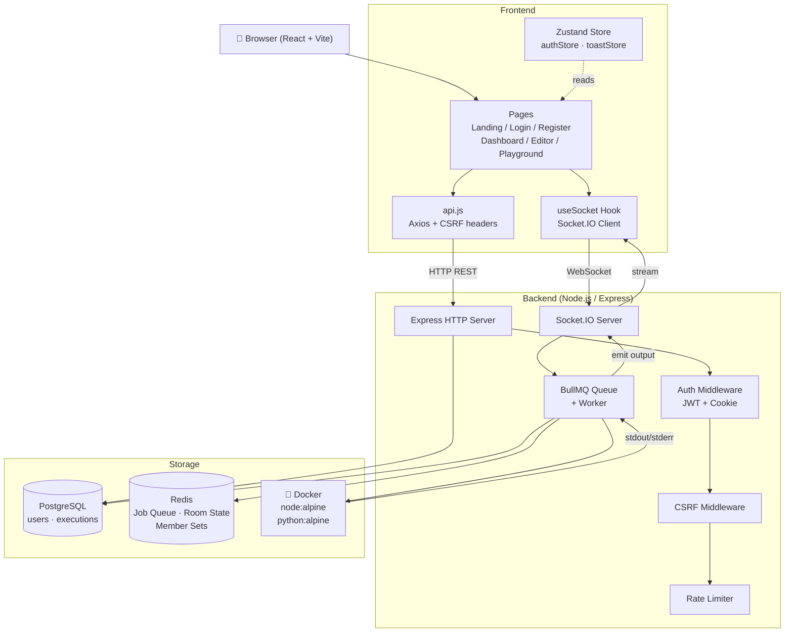

---

## 2. Authentication Flow

### How it works

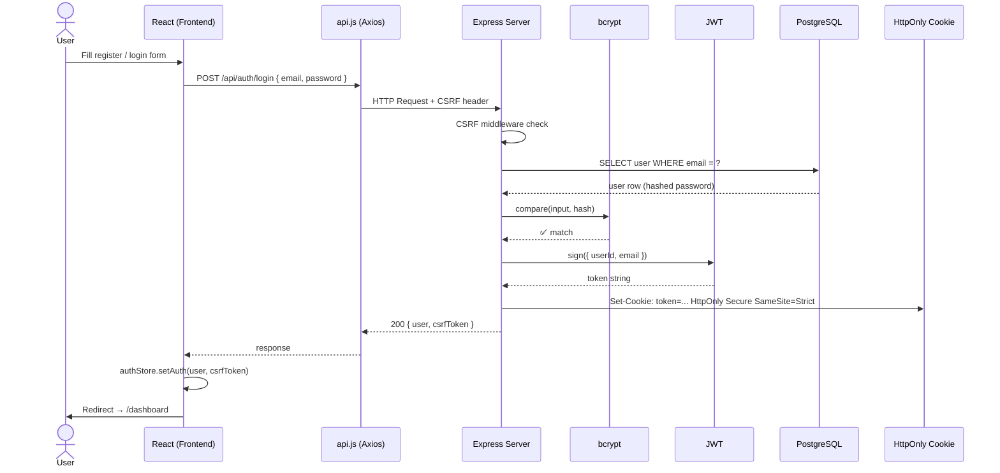

### Session hydration on page reload

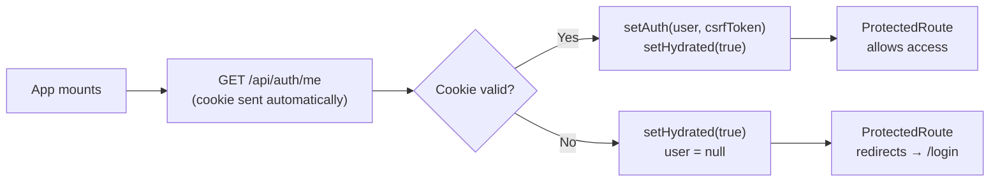

### CSRF Protection detail

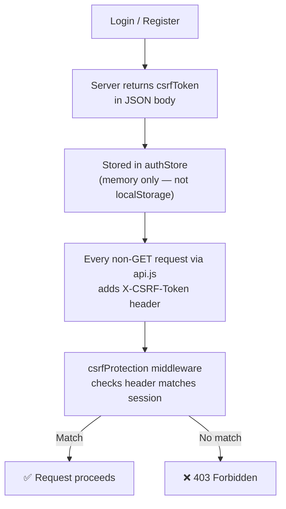

---

## 3. Code Execution Flow

### Full pipeline

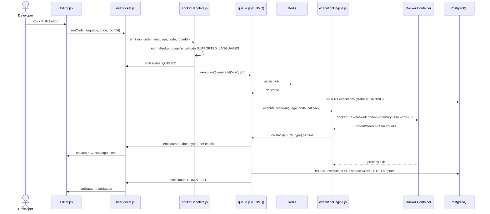

### Language normalization

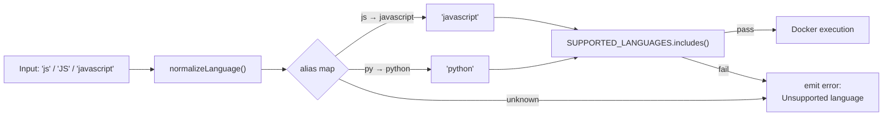

### Execution status machine

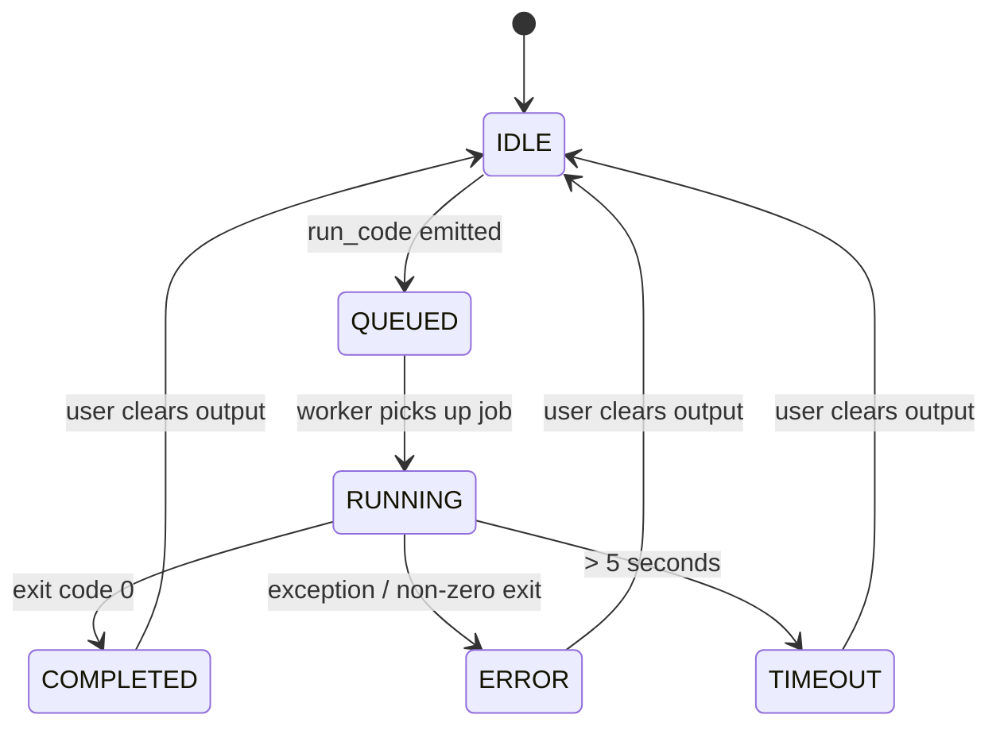

---

## 4. Real-Time Collaboration Flow

### Code sync between users

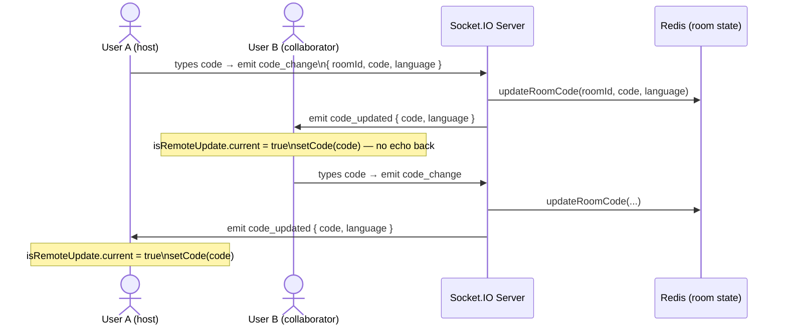

### Why `isRemoteUpdate` ref?

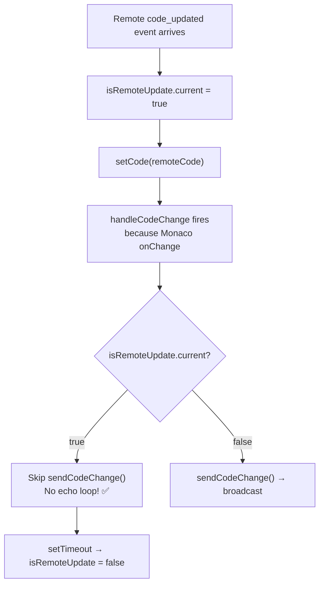

---

## 5. Room Join & Leave Flow

### Join flow

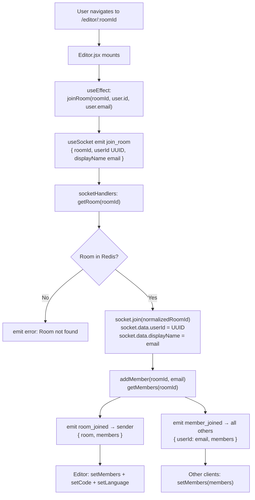

### Leave flow (disconnect)

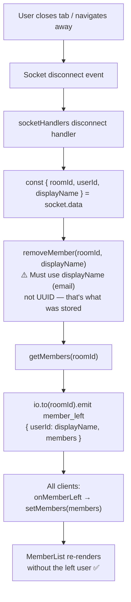

---

## 6. Frontend State Architecture

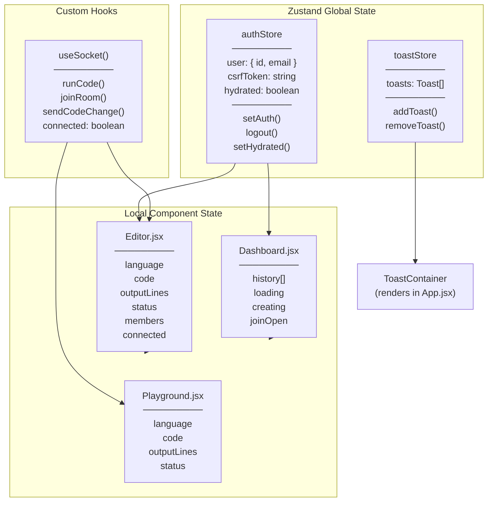

### Data flow for toast system

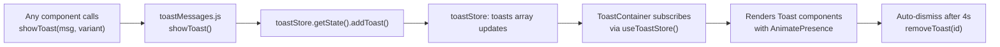

---

## 7. How Everything Connects

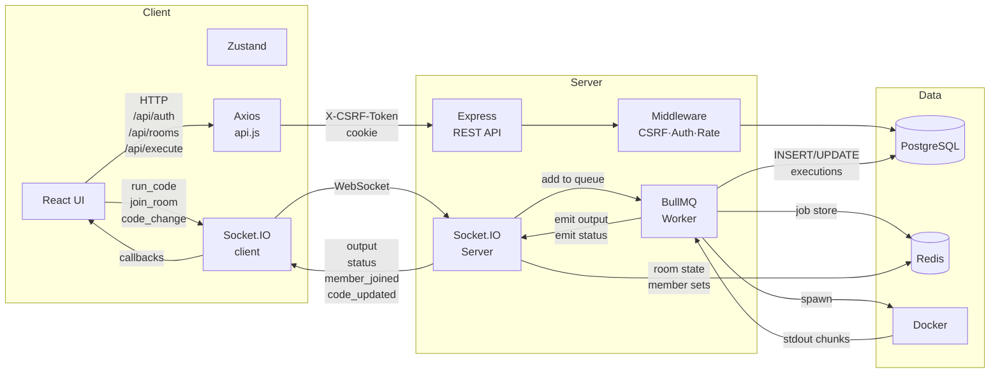

---

## 8. Challenges Faced & How I Solved Them

---

### Challenge 1 — Terminal not showing output (Stale Closure Bug)

**Problem:**
When the user clicked Run, the terminal stayed empty. The socket was connected and jobs were running (confirmed via logs), but `onOutput` was never updating the React state.

**Root Cause:**
`useSocket.js` registered the `output` event listener inside `useEffect([], ...)` — empty deps array means it runs once. The `onOutput` callback captured at mount time had a stale reference to the `setOutputLines` function from the first render. State updates from the socket were being discarded silently.

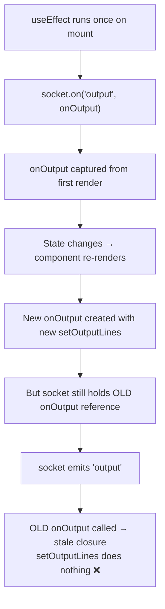

**Solution — Ref Forwarding Pattern:**

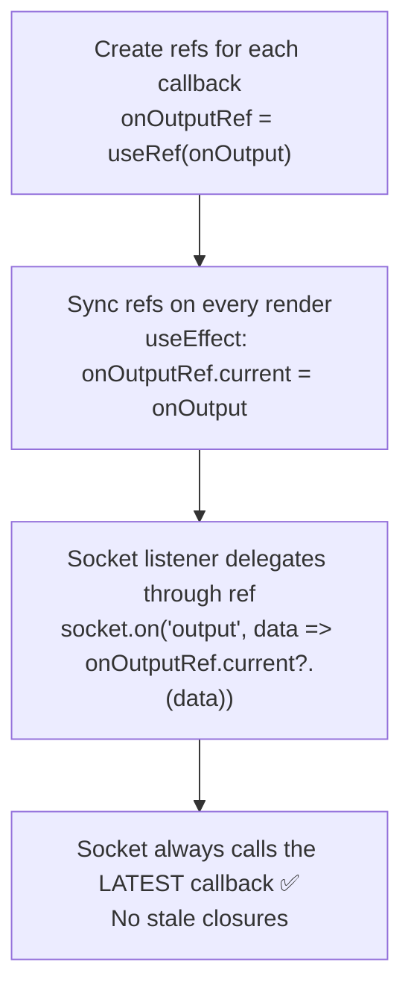

---

### Challenge 2 — Circular Import Crash (queue ↔ socketHandlers)

**Problem:**
`socketHandlers.js` imported `executionQueue` from `queue.js`. `queue.js` imported `getSocket` from `socketHandlers.js`. Node.js ESM handled this but one module received an incomplete binding — `getSocket` was `undefined` at runtime, so every socket lookup failed silently and output was never emitted.

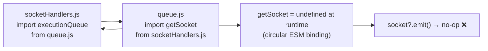

**Solution — setIo injection pattern:**

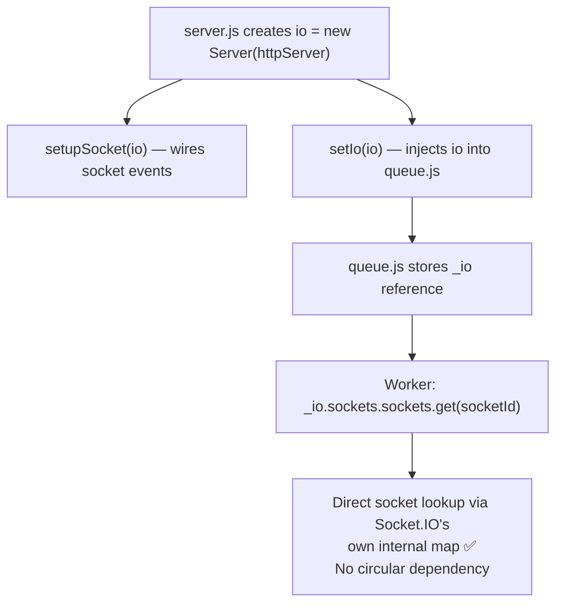

---

### Challenge 3 — UUID vs Email mismatch crashing executions

**Problem:**
After joining a room, running code caused:
```
job failed: invalid input syntax for type uuid: "user@gmail.com"
```

**Root Cause Chain:**

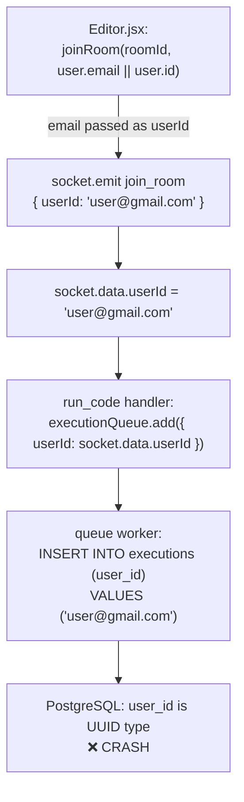

**Solution — Split UUID from DisplayName:**

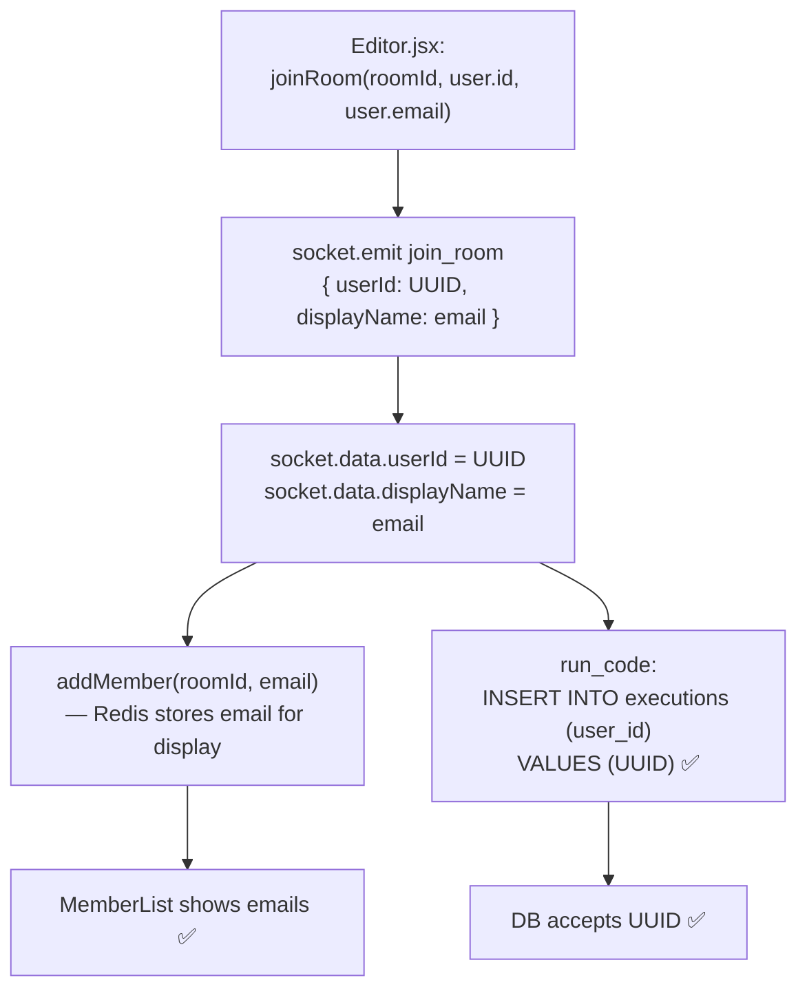

---

### Challenge 4 — Member never removed on disconnect

**Problem:**
When a user left the room, their name stayed in the member list permanently.

**Root Cause:**
At `join_room` we stored `displayName` (email) in the Redis member set.
At `disconnect` we called `removeMember(roomId, userId)` — passing the UUID.
Redis set lookup is exact — UUID ≠ email → nothing deleted.

```mermaid
flowchart LR
    JOIN["join_room:\naddMember(roomId, 'user@email.com')"]
    REDIS[("Redis Set\n'user@email.com'")]
    DISC["disconnect:\nremoveMember(roomId, 'uuid-1234')"]
    MISS["❌ 'uuid-1234' not in set\nNothing removed"]

    JOIN --> REDIS
    DISC --> MISS
    REDIS -.->|never touched| DISC
```

**Solution:**

```mermaid
flowchart LR
    JOIN["join_room:\nsocket.data.displayName = email\naddMember(roomId, email)"]
    REDIS[("Redis Set\n'user@email.com'")]
    DISC["disconnect:\nremoveMember(roomId, displayName)\n= removeMember(roomId, email)"]
    OK["✅ Email found and removed\nGetMembers → updated list\nio.emit member_left → all clients"]

    JOIN --> REDIS
    DISC --> OK
    REDIS --> OK
```

---

### Challenge 5 — dotenv loaded after validateEnv

**Problem:**
`validateEnv()` ran before `dotenv.config()` — all env vars were `undefined` during validation. The server would start with no DB/Redis config, causing silent connection failures.

```mermaid
flowchart LR
    A["validateEnv() ← runs first\nall process.env = undefined"]
    B["dotenv.config() ← runs second\nnow env loaded but too late"]
    A --> FAIL["Validation passes with undefined\nDB / Redis connection fails silently ❌"]
    B --> FAIL
```

**Fix:**
```mermaid
flowchart LR
    A["dotenv.config() ← runs FIRST"] --> B["validateEnv() ← now sees real values"]
    B --> C["All connections initialized correctly ✅"]
```

---

### Challenge 6 — Guest execution security (userId override)

**Problem:**
The `run_code` socket handler previously accepted a `userId` field from the client:
```js
socket.on("run_code", async ({ language, code, roomId, userId }) => {
  if (userId) socket.data.userId = userId  // ← DANGEROUS
```
Any client could send `userId: someOtherUUID` and write execution records to another user's account.

**Solution:**
`socket.data.userId` is now **set once at `join_room`** and **never overrideable** by any subsequent client event. The `run_code` handler ignores any userId in the payload entirely.

```mermaid
flowchart TD
    A["join_room event\n— authenticated context\n— userId verified from JWT session"]
    A --> B["socket.data.userId = verifiedUUID\n(set once, immutable for this connection)"]
    B --> C["run_code event\n— ignores any userId in payload"]
    C --> D["Uses socket.data.userId only\n✅ Tamper-proof"]
```

---

### Challenge 7 — Real-time output echo loop

**Problem:**
When User B received `code_updated` and called `setCode()`, Monaco's `onChange` fired, which called `sendCodeChange()` again, which broadcast back to everyone — creating an infinite loop.

**Solution — `isRemoteUpdate` ref guard:**

```mermaid
sequenceDiagram
    participant A as User A
    participant Srv as Server
    participant B as User B

    A->>Srv: code_change { code: "hello" }
    Srv->>B: code_updated { code: "hello" }
    Note over B: isRemoteUpdate.current = true
    B->>B: setCode("hello") → Monaco onChange fires
    B->>B: handleCodeChange checks isRemoteUpdate
    Note over B: isRemoteUpdate = true → SKIP sendCodeChange
    Note over B: setTimeout → isRemoteUpdate = false
    B--xSrv: ❌ Does NOT echo back
```

---

*End of Architecture Document*

> This document was written as a companion to `README.md`.
> All diagrams use [Mermaid](https://mermaid.js.org/) — render in GitHub, VS Code (Markdown Preview Mermaid), or [mermaid.live](https://mermaid.live).
